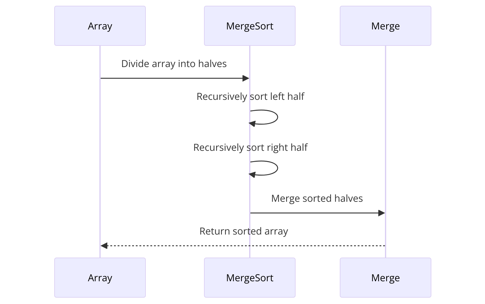

# Лабораторная работа 2-3

## Описание проекта

Проект `lab2-3` представляет собой программу для выполнения сортировки массива данных, генерации данных и анализа трудоемкости алгоритмов сортировки. Разработан в рамках лабораторной работы по курсу "Алгоритмы и структуры данных".

## Структура проекта

Проект содержит следующие основные компоненты:

- `lab2-3.sin` — файл решения для Visual Studio.
- `bab2-3/` — директория с исходным кодом программы:
  - `lab2-3.cpp` — основной исходный файл программы.

## Требования

Для сборки и запуска проекта необходимо:

- Visual Studio 2019 или новее.
- Компилятор C++, поддерживающий стандарт C++17.

## Сборка и запуск

Чтобы собрать и запустить проект, выполните следующие шаги:

1. Откройте файл решения `lab2-3.sin` в Visual Studio.
2. Выберите "Сборка решения" в меню "Сборка" или нажмите `Ctrl+Shift+B` для сборки проекта.
3. После успешной сборки выберите "Запустить без отладки" в меню "Отладка" или нажмите `Ctrl+F5` для запуска программы.

## Диаграмма сортировки

   
## Вклад в проект

Мы приветствуем вклад в наш проект! Если вы хотите предложить улучшения или сообщить об ошибках, пожалуйста, создайте новый issue или pull request в репозитории на GitHub.

## Лицензия

Проект распространяется под лицензией MIT [LICENSE](LICENSE).
